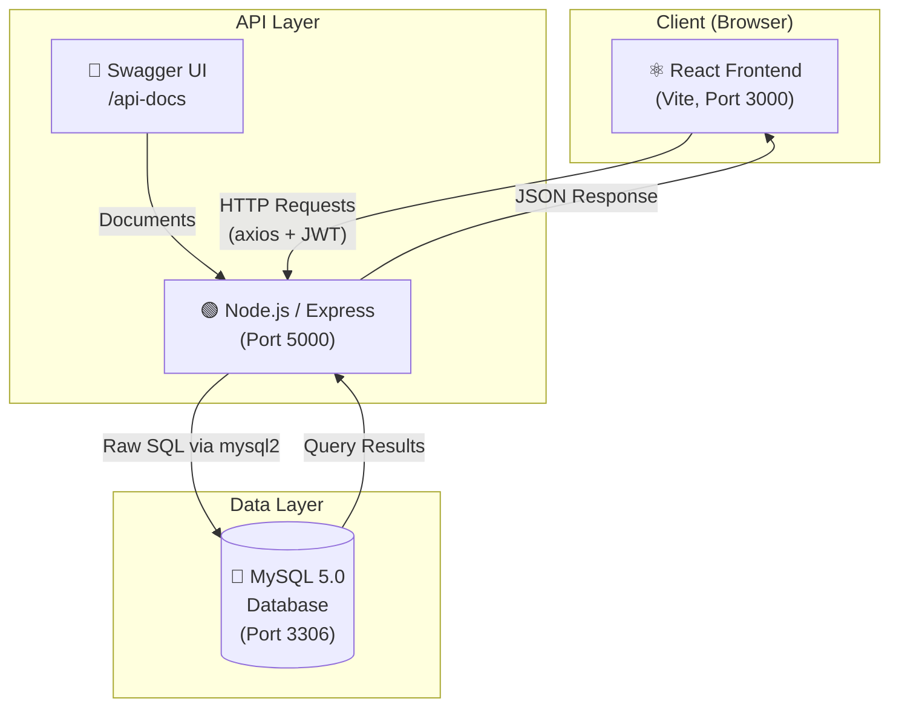
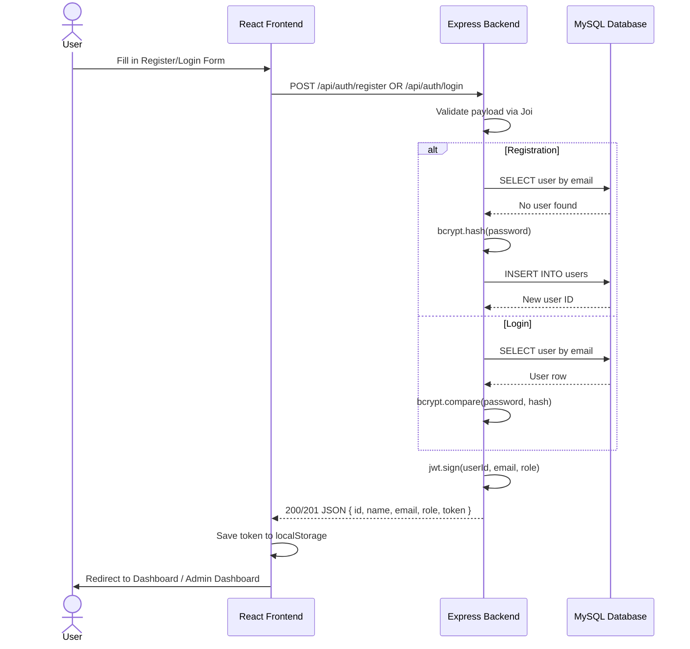
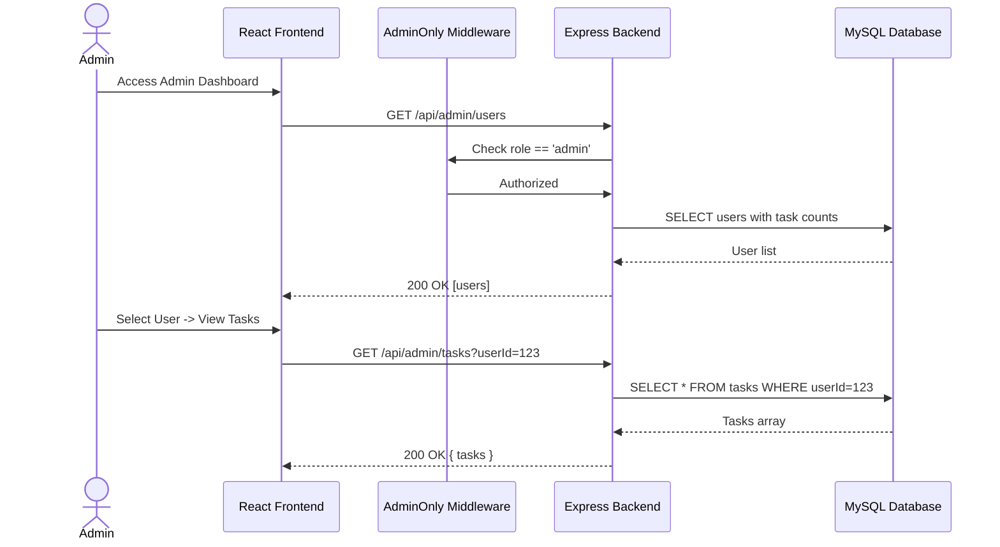
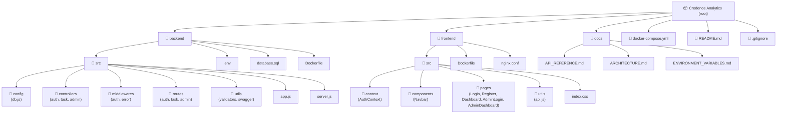
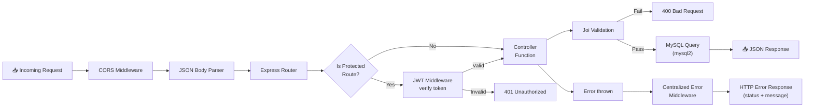

# Project Architecture & Flow

This document describes the complete flow of the Task Management Application using architecture and sequence diagrams.

---

## 🏗️ System Architecture Overview



---

## 🔒 Authentication Flow



---


## 🛡️ Admin Management Flow


```

---

## 📁 Project Folder Structure



---

## 🔄 Request Lifecycle (Middleware Chain)


